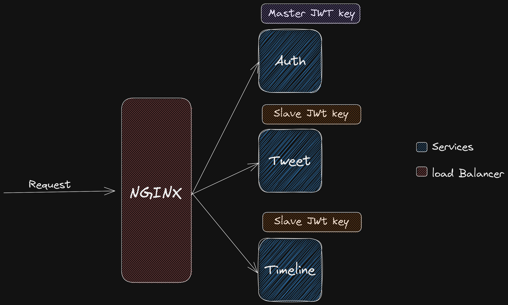
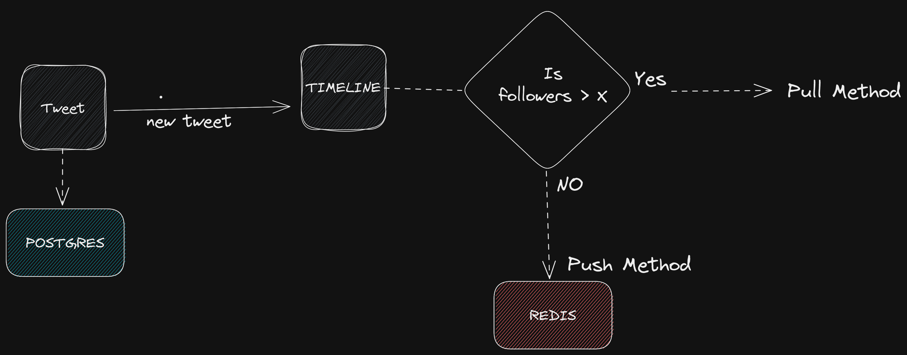

# Twitter Backend API

This is a Twitter-Backend side project written in Golang along with
database like PostgreSQL and Redis, and RabbitMQ as message Queue.

[Article explaining the internals:](https://medium.com/@leoantony102/how-i-made-twitter-back-end-57addbaa14f5)

# Docker Build

```bash
docker network create Twitter
```

```bash
docker-compose up -d
```

<b>Only the logs of services are outputed rest are disabled in docker-compose file</b>

# Authentication

This API uses JWT (JSON Web Tokens) for authentication. When a user logs in, the API generates a JWT containing the user's id, which is used to authenticate all subsequent requests. I have usen Asymmetric
JWTs so it have an private and a public key. private key will be used for creating tokens and public key will be used for verifying the tokens. The Public key is shared by other service for authentication.



# Endpoints

## Auth

&nbsp;

### Routes:

&nbsp;

| Method | Url                 | Description               |
| ------ | ------------------- | ------------------------- |
| POST   | /auth/signup        | Creates a new user.       |
| POST   | /auth/login         | Login a user              |
| POST   | /auth/logout        | Logout a user             |
| POST   | /auth/refresh-token | Generate new access Token |

## User

&nbsp;

### Routes:

&nbsp;

| Method | Url                      | Description       |
| ------ | ------------------------ | ----------------- |
| GET    | /user/data/:username     | Gets User Details |
| DELETE | /                        | Delete User       |
| UPDATE | /                        | Update User       |
| POST   | /user/follow?username=   | Follows User      |
| POST   | /user/unfollow?username= | Unfollows User    |

## Tweet

&nbsp;

### Routes:

&nbsp;

| Method | Url                   | Description           |
| ------ | --------------------- | --------------------- |
| POST   | /tweet/create         | Create Tweet          |
| GET    | /tweet/id/:id         | Get Tweet By ID       |
| DELETE | /tweet/id/:id/delete  | Del Tweet by ID       |
| POST   | /tweet/id/:id/like    | Like a Tweet by ID    |
| POST   | /tweet/id/:id/dislike | DisLike a Tweet by ID |
| POST   | /tweet/id/:id/retweet | Retweet a tweet       |
| DELETE | /tweet/id/:id/retweet | del a Retweet         |

## Timeline

&nbsp;

### Routes:

&nbsp;

| Method | Url                             | Description                               |
| ------ | ------------------------------- | ----------------------------------------- |
| GET    | /timeline/home?start=           | Gets User's Home timeline                 |
| GET    | /timeline/user?username=&start= | Gets User Timeline by specifying username |

# Architecture

As you know this project in microservice architecture, So each service is independent.
Tweet service and Timeline service is connected through Message Queue (RabbitMq). Tweet Service sends the new tweets to Timeline Service and Timleine service pushes these to respective tweet authors followers timeline If authors follower count is less than 10(I know it's very low but for testing this is fine). If it's above 10 followers would fetch tweet when they load the timeline.



&nbsp;

# Conclusion

This was a fun project, I'm glad I could finish this project😬 learned some new things like How twitter timeline works, consul(service register), HAproxy(load balancer), RabbitMq(Message Queue) and Asymmetric JWT token. Now going back to learning👋.

Twitter Journey: "https://twitter.com/serpico_z/status/1605899167439757312"
